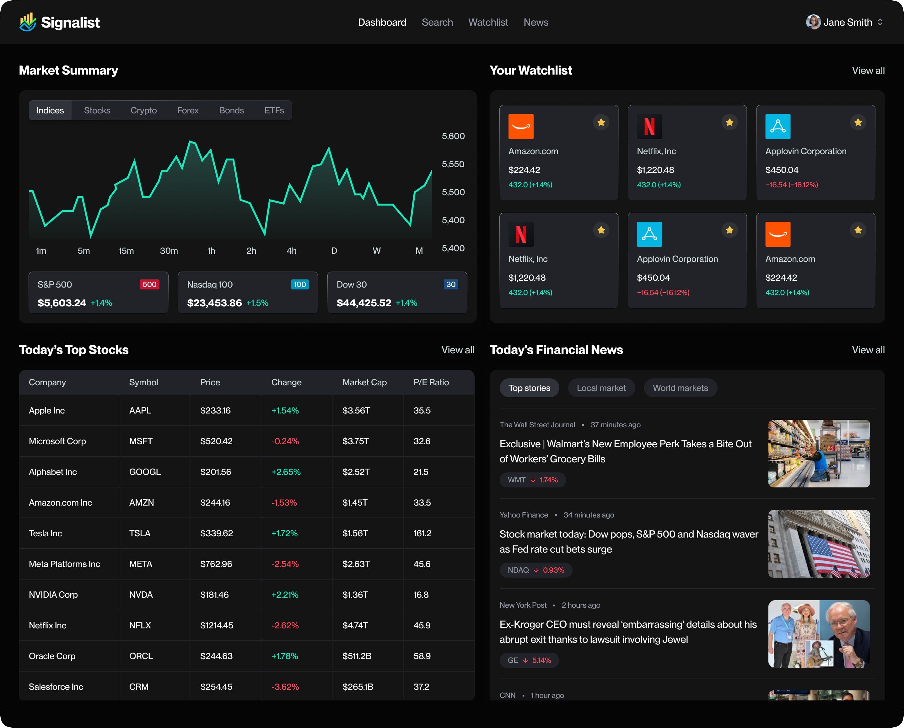
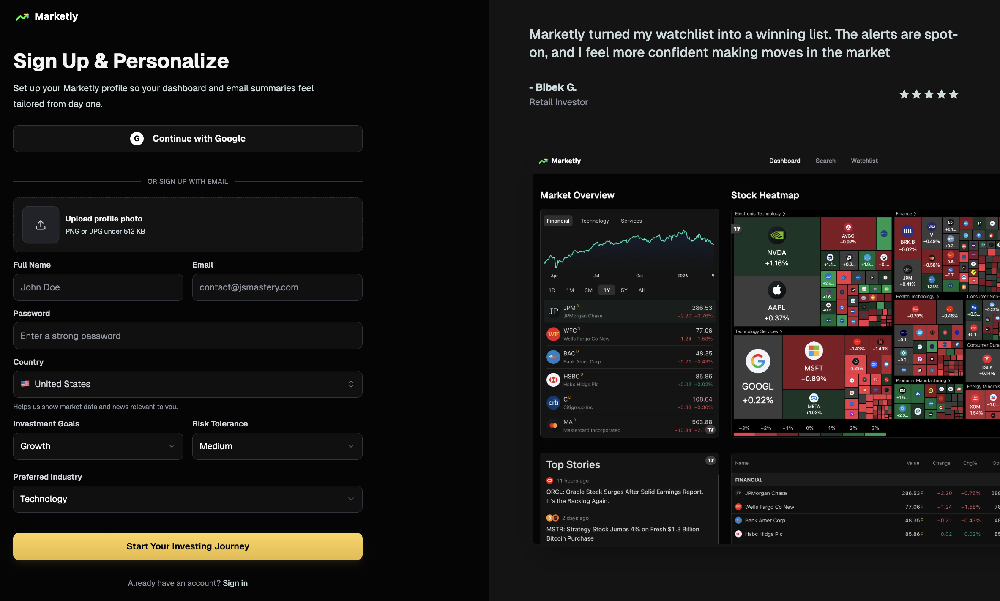
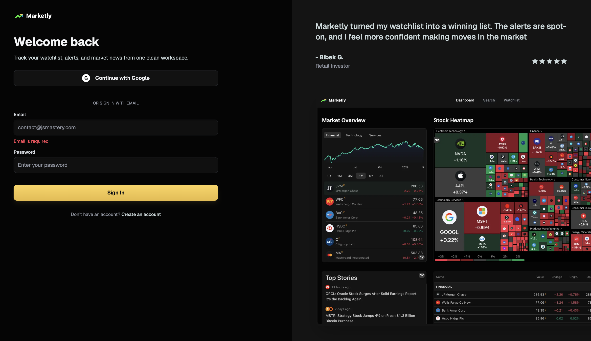

# Marketly - Stock Tracker App

Marketly is a full-stack stock tracking application built with Next.js. It helps users monitor stocks, manage a personal watchlist, read market news, create price alerts, receive email notifications, and manage their account profile from one dashboard.

The app includes email/password authentication, Google sign-in, profile photo upload, watchlist categories, stock notes, a notification drawer, personalized market news, price alert emails, and responsive layouts for desktop and mobile.



## Features

- User authentication with email/password and Google OAuth
- Profile management with name, phone number, password, and profile photo updates
- Stock search powered by Finnhub
- Dashboard with market overview and TradingView widgets
- Watchlist management with categories and stock notes
- Responsive watchlist table on desktop and mobile cards on smaller screens
- Stock detail pages with charts and company data
- News page with watchlist-based news and fallback general market news
- Price alerts with email notifications
- In-app notification center in the header
- Daily news summary email workflow
- Mobile-friendly UI and dark theme styling

## Tech Stack

- **Framework:** Next.js 16
- **Frontend:** React 19, TypeScript, Tailwind CSS
- **UI Components:** Radix UI, cmdk, Lucide React, Sonner
- **Authentication:** Better Auth
- **Database:** MongoDB with Mongoose
- **Market Data:** Finnhub API
- **Charts:** TradingView widgets
- **Background Jobs:** Inngest
- **AI Summaries:** Gemini API
- **Email:** Nodemailer with Gmail SMTP
- **Deployment:** Vercel

## Project Structure

```bash
stocks_app/
├── app/
│   ├── (auth)/              # Sign in and sign up pages
│   ├── (root)/              # Protected dashboard, news, watchlist, and stock pages
│   └── api/inngest/         # Inngest API route
├── components/              # Reusable UI and feature components
├── database/                # MongoDB connection and Mongoose models
├── lib/
│   ├── actions/             # Server actions
│   ├── better-auth/         # Better Auth server/client config
│   ├── inngest/             # Background jobs and prompts
│   └── nodemailer/          # Email sender and email templates
├── public/assets/           # Images and icons
└── README.md
```

## Installation And Setup

### 1. Clone The Repository

```bash
git clone <your-repository-url>
cd stocks_app
```

### 2. Install Dependencies

```bash
npm install
```

### 3. Create Environment Variables

Create a `.env.local` file in the root of the project.

```bash
touch .env.local
```

Add the following variables:

```env
MONGODB_URI=your_mongodb_connection_string

BETTER_AUTH_SECRET=your_better_auth_secret
BETTER_AUTH_URL=http://localhost:3000
NEXT_PUBLIC_BASE_URL=http://localhost:3000

GOOGLE_CLIENT_ID=your_google_client_id
GOOGLE_CLIENT_SECRET=your_google_client_secret

NEXT_PUBLIC_FINNHUB_API_KEY=your_finnhub_api_key
GEMINI_API_KEY=your_gemini_api_key

NODEMAILER_EMAIL=your_gmail_address
NODEMAILER_PASSWORD=your_gmail_app_password

INNGEST_EVENT_KEY=your_inngest_event_key
INNGEST_SIGNING_KEY=your_inngest_signing_key

NODE_ENV=development
```

Notes:

- `MONGODB_URI` is required for users, watchlists, alerts, and notifications.
- `BETTER_AUTH_SECRET` should be a long random string.
- `GOOGLE_CLIENT_ID` and `GOOGLE_CLIENT_SECRET` are required for Google login.
- `NODEMAILER_PASSWORD` should be a Gmail app password, not the normal Gmail password.
- `NEXT_PUBLIC_BASE_URL` and `BETTER_AUTH_URL` should match the deployed URL in production.

## Running The Application Locally

Start the development server:

```bash
npm run dev
```

Open the app in your browser:

```bash
http://localhost:3000
```

Run TypeScript checks:

```bash
npx tsc --noEmit
```

Run linting:

```bash
npm run lint
```

Test the database connection:

```bash
npm run test:db
```

## Background Jobs With Inngest

Marketly uses Inngest for background workflows such as:

- Daily news summary emails
- Scheduled price alert checks
- In-app notifications for triggered alerts

For local Inngest testing, run the app locally and connect it to the Inngest dev server if needed:

```bash
npm run dev
```

The Inngest endpoint is available at:

```bash
http://localhost:3000/api/inngest
```

In production, the endpoint should be:

```bash
https://your-production-domain.com/api/inngest
```

## Deployment

The easiest deployment option is Vercel.

### 1. Push Code To GitHub

```bash
git add .
git commit -m "Prepare Marketly for deployment"
git push
```

### 2. Import Project In Vercel

1. Go to [Vercel](https://vercel.com).
2. Import the GitHub repository.
3. Select the Next.js framework preset.
4. Add all required environment variables.
5. Deploy the application.

### 3. Production Environment Variables

In Vercel, set:

```env
BETTER_AUTH_URL=https://your-production-domain.com
NEXT_PUBLIC_BASE_URL=https://your-production-domain.com
NODE_ENV=production
```

Also add the same production values for:

- `MONGODB_URI`
- `BETTER_AUTH_SECRET`
- `GOOGLE_CLIENT_ID`
- `GOOGLE_CLIENT_SECRET`
- `NEXT_PUBLIC_FINNHUB_API_KEY`
- `GEMINI_API_KEY`
- `NODEMAILER_EMAIL`
- `NODEMAILER_PASSWORD`
- `INNGEST_EVENT_KEY`
- `INNGEST_SIGNING_KEY`

### 4. Google OAuth Redirect URLs

In Google Cloud Console, add the production callback URL:

```bash
https://your-production-domain.com/api/auth/callback/google
```

For local development, also add:

```bash
http://localhost:3000/api/auth/callback/google
```

### 5. Inngest Production Setup

In the Inngest dashboard, sync or register the production endpoint:

```bash
https://your-production-domain.com/api/inngest
```

Make sure `INNGEST_EVENT_KEY` and `INNGEST_SIGNING_KEY` are configured in Vercel for the correct environment.

## Example Usage

### Sign Up Or Sign In

Users can create an account with email/password or continue with Google. After signup, Marketly sends a welcome email using the configured Nodemailer email account.

### Search And Add Stocks

Use the search option in the header or watchlist page to find stocks. Add a stock to the watchlist to track it later.

### Manage Watchlist

The watchlist page lets users:

- View saved stocks
- Filter and search watchlist items
- Add custom notes
- Assign categories
- Remove stocks
- See current stock data

### View News

The News page loads articles based on the user watchlist. If no watchlist news is available, it displays general market news.

### Create Price Alerts

Users can create an alert for a stock and choose whether the alert should trigger when the price goes above or below a target price. When triggered, the system creates an in-app notification and sends an email.

### Manage Profile

From the avatar menu, users can:

- Update profile details
- Add a phone number
- Change password
- Change profile photo
- Log out

## Screenshots

### Dashboard Preview


### Authentication Preview





## Scripts

```bash
npm run dev       # Start local development server
npm run build     # Build the production app
npm run start     # Start production server
npm run lint      # Run ESLint
npm run test:db   # Test MongoDB connection
```

## Future Improvements

- Add an email preferences page for unsubscribe and notification settings
- Add portfolio tracking with shares and average cost
- Add stock comparison charts
- Add alert history and analytics
- Add pagination and saved filters for news
- Improve email delivery using a dedicated provider such as Resend, Postmark, or SendGrid

## Author

Marketly was developed as a senior project stock tracking application focused on improving the user experience for monitoring stocks, alerts, and market news.
